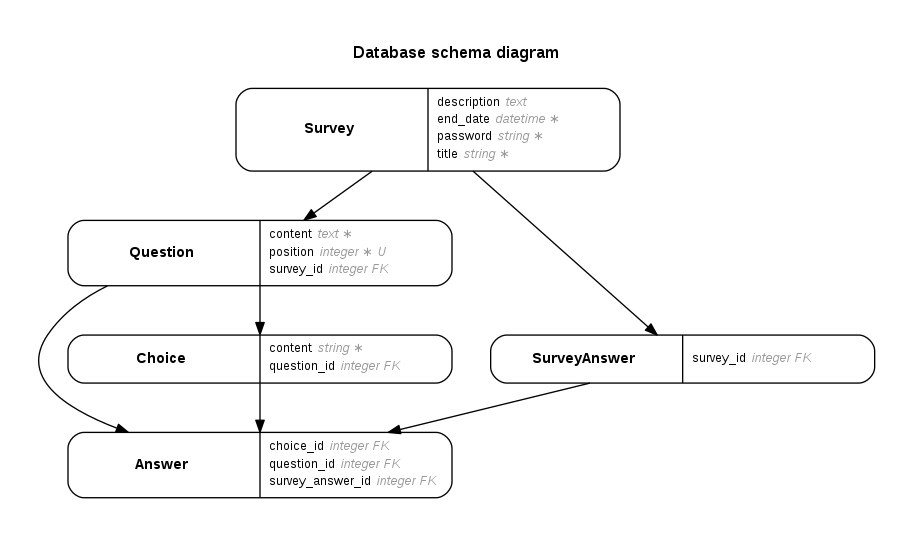

# README

This application was developed during a _Web development/Ruby on Rails_ 2-day crash course1 with students from the Université de Bordeaux.

Everything2 was coded by the students under my counsel and advice.  
They previously had created another minimal Rails application3 under complete guided instructions to get familiar with the basics of Rails but learnt most of what they applied here through a cycle of questions followed by application of the answers. 

The project uses _Ruby 2.2.3_ and _Rails 4.2.4_

### Getting the project to run.
* [Install Ruby 2.2.3](https://github.com/Aquaj/project-forms/wiki/Installing-Ruby).

* Install the bundler gem.
  >gem install bundler

* Install the gem dependencies.
  >bundle install

* Launch the server.
  >rails server

### Database diagram

 
##### Footnotes

1: This implies gathering up at one of the students' place and downing both pizza and Monster energy drinks while putting them through exercises that would allow them to grok concepts such as the MVC design pattern or the handling of a HTTP request by the server and subsequently the router.

2: My direct hand was only applied for:  
- **the Heroku config of the project** to show them how quick a project can be put online as a motivation source.  
- **the adding of documentation** in hope they can use it to retain the concepts seen during this week-end as long as possible.

3: This Rails application consisted simply of `Message`s categorized under `Label`s with basic `scaffold`-generated views. 